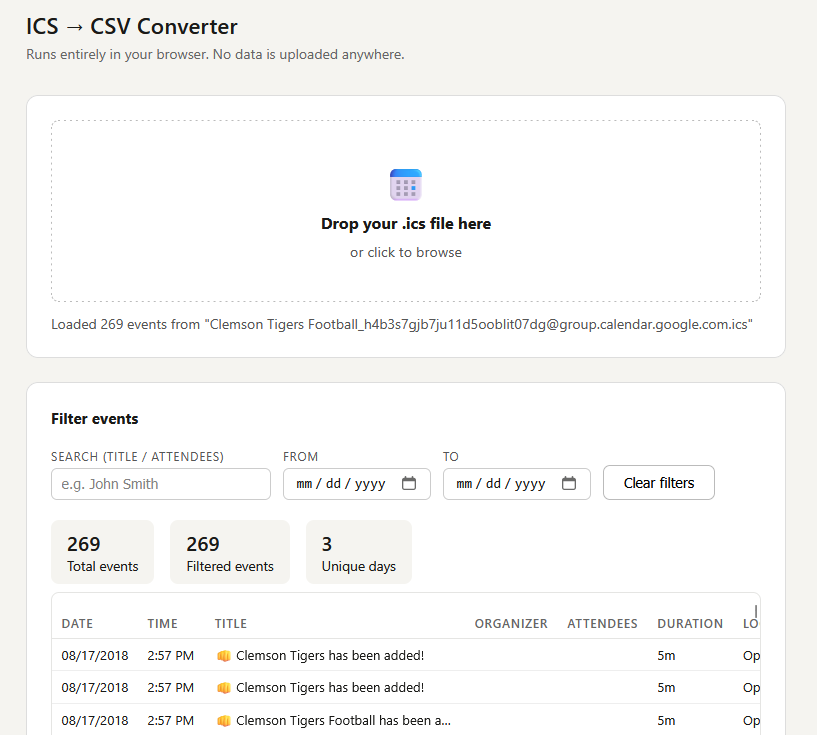

# ICS to CSV Converter

A single-file tool that converts calendar export files (.ics) into spreadsheet-ready CSV files.

## What it does

Most calendar applications (Google Calendar, Outlook, Apple Calendar) let you export your events as an `.ics` file. This tool reads that file and converts it into a `.csv` file you can open in Excel, Google Sheets, or any spreadsheet program.

You can filter by date range or search for specific events before exporting.

## How it works

**This is one HTML file. That's the whole tool.** There is no installer, no app to download, no account to create.

1. Download **`ics-to-csv.html`** — click the file above, then click the download button (the downward arrow icon). That's it. One file, nothing to unzip.
2. Double-click the file. It will open in your web browser (Chrome, Firefox, Edge, Safari — any will work).
3. Drag your `.ics` file onto the page, or click to browse for it.
4. Use the filters if you want to narrow down your events.
5. Click **Download CSV**.

## Your data stays on your computer

This tool runs **entirely inside your web browser**. When you open the file, your browser runs it locally — the same way it would display a photo or a PDF you saved to your desktop. Your calendar data is never uploaded, transmitted, or sent anywhere. There is no server. There is no internet connection required after you download the file. No one — including the author — can see your data.

You can verify this yourself: disconnect from the internet after downloading the file, and it will work exactly the same way.

## What "runs locally" means

When you visit most websites, your browser sends information back and forth to a computer somewhere on the internet. This tool is different. It is a file sitting on your computer, running inside your browser, with no connection to anything else. Think of it like a calculator app — it does its work right where it is, without phoning home.

## License

MIT — free to use, modify, and share. See [LICENSE](LICENSE).

---

Built by [dtiger1889-ops](https://github.com/dtiger1889-ops)
